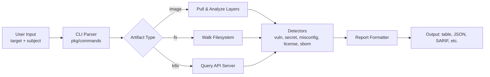
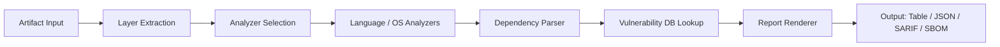
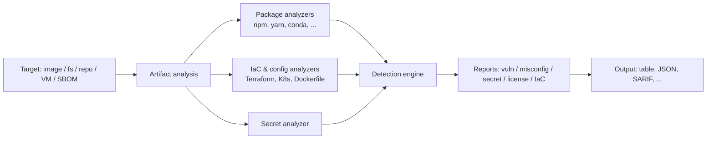
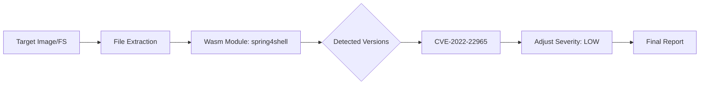

# Human Manual

## What This Pack Helps With

load Trivy scanning context, vulnerability and secret-scan boundaries, container/Kubernetes checks, and safe verification notes into your AI host before scanning real systems

## How To Use

1. Read `README.md`.
2. Load `AGENTS.md` or `CLAUDE.md`.
3. Run evals.
4. Use pitfall and risk files to recover from failure.

## What This Pack Does Not Do

- It does not replace upstream docs.
- It does not prove production readiness.
- It does not claim official endorsement.

## Doramagic Source Extract

# https://github.com/aquasecurity/trivy Project Manual

Generated at: 2026-06-19 03:36:17 UTC

## Table of Contents

- [Trivy Overview and Getting Started](#page-1)
- [System Architecture and Core Components](#page-2)
- [Scanning Capabilities: Vulnerabilities, Misconfigurations, Secrets, Licenses, and IaC](#page-3)
- [Configuration, Output Formats, Reporting, Plugins, and Operations](#page-4)

<a id='page-1'></a>

## Trivy Overview and Getting Started

### Related Pages

Related topics: [System Architecture and Core Components](#page-2), [Scanning Capabilities: Vulnerabilities, Misconfigurations, Secrets, Licenses, and IaC](#page-3), [Configuration, Output Formats, Reporting, Plugins, and Operations](#page-4)

<details>
<summary>Related Source Files</summary>

The following source files were used to generate this page:

- [README.md](https://github.com/aquasecurity/trivy/blob/main/README.md)
- [helm/trivy/README.md](https://github.com/aquasecurity/trivy/blob/main/helm/trivy/README.md)
- [integration/README.md](https://github.com/aquasecurity/trivy/blob/main/integration/README.md)
- [examples/module/spring4shell/README.md](https://github.com/aquasecurity/trivy/blob/main/examples/module/spring4shell/README.md)
- [brand/readme.md](https://github.com/aquasecurity/trivy/blob/main/brand/readme.md)
</details>

# Trivy Overview and Getting Started

## What is Trivy

Trivy is an open-source, all-in-one security scanner maintained by Aqua Security. According to the [README.md](https://github.com/aquasecurity/trivy/blob/main/README.md), it is designed for software developers and security teams to discover vulnerabilities, misconfigurations, secrets, and SBOM-related issues across the software supply chain. The project is licensed under Apache 2.0 and is part of Aqua's broader open-source portfolio [Source: [README.md:1-40]()](https://github.com/aquasecurity/trivy/blob/main/README.md).

Trivy ships as a single static binary, a container image, a Homebrew formula, and a Helm chart. This packaging flexibility makes it deployable in CI pipelines, local development environments, and Kubernetes clusters with minimal friction.

## Installation

The README documents several popular installation channels:

- **Homebrew**: `brew install trivy` [Source: [README.md:30-40]()](https://github.com/aquasecurity/trivy/blob/main/README.md)
- **Docker**: `docker run aquasec/trivy`
- **Binary download**: Releases published at <https://github.com/aquasecurity/trivy/releases/latest/>
- **Canary builds**: Generated on every push to the main branch and published to Docker Hub, GHCR, and ECR; explicitly **not recommended for production** [Source: [README.md:42-55]()](https://github.com/aquasecurity/trivy/blob/main/README.md)

For Kubernetes deployments, a Helm chart is provided in the [helm/trivy/README.md](https://github.com/aquasecurity/trivy/blob/main/helm/trivy/README.md) file. Installation is performed via:

```bash
helm repo add aquasecurity https://aquasecurity.github.io/helm-charts/
helm install my-trivy aquasecurity/trivy
```

Prerequisites for the Helm chart are Kubernetes 1.12+ and Helm 3+ [Source: [helm/trivy/README.md:11-20]()](https://github.com/aquasecurity/trivy/blob/main/helm/trivy/README.md). The chart exposes configurable parameters for image registry, replica count, debug mode, GitHub token (for DB downloads), Docker Hub credentials, service type/port, and proxy settings [Source: [helm/trivy/README.md:30-80]()](https://github.com/aquasecurity/trivy/blob/main/helm/trivy/README.md).

## General Usage

Trivy uses a uniform CLI shape:

```bash
trivy <target> [--scanners <scanner1,scanner2>] <subject>
```

The README demonstrates the three primary targets [Source: [README.md:57-90]()](https://github.com/aquasecurity/trivy/blob/main/README.md):

| Target | Example Command | Purpose |
|--------|-----------------|---------|
| `image` | `trivy image python:3.4-alpine` | Scan container images for OS and library vulnerabilities |
| `fs` | `trivy fs --scanners vuln,secret,misconfig myproject/` | Scan a local filesystem for vulnerabilities, secrets, and IaC misconfigurations |
| `k8s` | `trivy k8s --report summary cluster` | Scan a live Kubernetes cluster and produce a summary report |

The `--scanners` flag enables selective execution of detection passes, which is useful when full vulnerability scanning is slow or when only one concern (e.g., secret detection) is needed.

### Workflow overview



## Extending Trivy with Modules

Trivy supports a WASM-based module system that allows custom analyzers to be plugged in. The Spring4Shell example in [examples/module/spring4shell/README.md](https://github.com/aquasecurity/trivy/blob/main/examples/module/spring4shell/README.md) demonstrates this. A module is built with `GOOS=wasip1 GOARCH=wasm` and installed under `~/.trivy/modules/` [Source: [examples/module/spring4shell/README.md:7-15]()](https://github.com/aquasecurity/trivy/blob/main/examples/module/spring4shell/README.md). Modules can also be pulled directly from GHCR using `trivy module install`. The example downgrades CVE-2022-22965 severity for non-vulnerable Java versions, illustrating how domain-specific logic can refine raw scanner output.

## Integration and Testing

Trivy ships a comprehensive integration test suite under the `integration/` directory. These tests execute real Trivy commands and compare output against golden files located in `integration/testdata/*.golden` [Source: [integration/README.md:9-15]()](https://github.com/aquasecurity/trivy/blob/main/integration/README.md). Contributors run them via `mage test:integration`, with sub-commands for module, VM, and Kubernetes test groups.

A notable convention is the **canonical golden file** pattern: only one test function may update a given golden file. Other tests verify against it in read-only mode, ensuring stable, deterministic output [Source: [integration/README.md:40-60]()](https://github.com/aquasecurity/trivy/blob/main/integration/README.md). Golden files are refreshed with `mage test:updateGolden` or the `-update` flag on canonical tests.

## Community-Caught Considerations

Several frequently discussed community issues are relevant to anyone getting started:

- **#3421 — Scan timeouts**: Users report `trivy image` scans that previously completed in under a minute suddenly timing out. The `--security-checks vuln` setting has no effect on the timeout. The reported versions (v0.24.2 and "current latest") are very old; the latest release **v0.71.1** includes a fix that forwards OS package detector options through `ospkg.NewScanner` [Source: [changelog entry in community_context]()]. Upgrading is the recommended first step before deeper troubleshooting.
- **#3243 — Multiple outputs**: A long-standing feature request to emit a report to the console *and* a file in a single run. As of v0.71.1 this is not yet supported in a single invocation and typically requires shell redirection or a wrapper script.
- **#3560 — Java DB in server mode**: Even when Trivy is configured in client/server mode, the client still downloads the Java DB locally if a Java package is detected. Users wanting a pure centralized setup must monitor this behavior.
- **#3201 — Markdown report format**: SARIF remains the de facto format for CI/PR integration; community-submitted Markdown templates have not been merged into core.

These items are useful context for sizing expectations when first integrating Trivy into a build pipeline.

## See Also

- [Trivy Official Documentation](https://trivy.dev/docs/latest/)
- [Installation Reference](https://trivy.dev/docs/latest/getting-started/installation/)
- [Ecosystem & Integrations](https://trivy.dev/docs/latest/ecosystem/)
- [Scanning Coverage](https://trivy.dev/docs/latest/coverage/)
- [GitHub Releases](https://github.com/aquasecurity/trivy/releases)

---

<a id='page-2'></a>

## System Architecture and Core Components

### Related Pages

Related topics: [Trivy Overview and Getting Started](#page-1), [Scanning Capabilities: Vulnerabilities, Misconfigurations, Secrets, Licenses, and IaC](#page-3), [Configuration, Output Formats, Reporting, Plugins, and Operations](#page-4)

<details>
<summary>Related Source Files</summary>

The following source files were used to generate this page:

- [README.md](https://github.com/aquasecurity/trivy/blob/main/README.md)
- [pkg/dependency/parser/nodejs/packagejson/testdata/package.json](https://github.com/aquasecurity/trivy/blob/main/pkg/dependency/parser/nodejs/packagejson/testdata/package.json)
- [pkg/dependency/parser/nodejs/packagejson/testdata/legacy_package.json](https://github.com/aquasecurity/trivy/blob/main/pkg/dependency/parser/nodejs/packagejson/testdata/legacy_package.json)
- [pkg/dependency/parser/nodejs/packagejson/testdata/legacy_array_package.json](https://github.com/aquasecurity/trivy/blob/main/pkg/dependency/parser/nodejs/packagejson/testdata/legacy_array_package.json)
- [pkg/dependency/parser/nodejs/packagejson/testdata/without_name_and_version_package.json](https://github.com/aquasecurity/trivy/blob/main/pkg/dependency/parser/nodejs/packagejson/testdata/without_name_and_version_package.json)
- [pkg/fanal/analyzer/language/nodejs/yarn/testdata/happy/package.json](https://github.com/aquasecurity/trivy/blob/main/pkg/fanal/analyzer/language/nodejs/yarn/testdata/happy/package.json)
- [pkg/fanal/analyzer/language/nodejs/yarn/testdata/monorepo/packages/utils/util1/package.json](https://github.com/aquasecurity/trivy/blob/main/pkg/fanal/analyzer/language/nodejs/yarn/testdata/monorepo/packages/utils/util1/package.json)
- [pkg/fanal/analyzer/language/nodejs/yarn/testdata/monorepo/packages/package2/package.json](https://github.com/aquasecurity/trivy/blob/main/pkg/fanal/analyzer/language/nodejs/yarn/testdata/monorepo/packages/package2/package.json)
- [pkg/fanal/analyzer/language/nodejs/yarn/testdata/project-with-workspace-in-subdir/foo/package.json](https://github.com/aquasecurity/trivy/blob/main/pkg/fanal/analyzer/language/nodejs/yarn/testdata/project-with-workspace-in-subdir/foo/package.json)
- [pkg/fanal/analyzer/language/nodejs/yarn/testdata/alias/package.json](https://github.com/aquasecurity/trivy/blob/main/pkg/fanal/analyzer/language/nodejs/yarn/testdata/alias/package.json)
- [examples/module/spring4shell/README.md](https://github.com/aquasecurity/trivy/blob/main/examples/module/spring4shell/README.md)
- [brand/readme.md](https://github.com/aquasecurity/trivy/blob/main/brand/readme.md)
</details>

# System Architecture and Core Components

## Overview and Purpose

Trivy is an open-source security scanner maintained by Aqua Security that discovers software vulnerabilities, misconfigurations, secrets, and software bill of materials (SBOM) across a wide range of artifact types. As stated in the project [README.md](https://github.com/aquasecurity/trivy/blob/main/README.md), the tool positions itself as a comprehensive scanner with extensive coverage and aims to be simple to install with zero modifications required to existing workflows.

The repository is organized around a few high-level responsibilities that the core components implement:

- **Artifact ingestion** — accepting container images, filesystems, Git repositories, virtual machine images, and OCI registries.
- **Layer extraction and analysis** — unpacking artifacts so that analyzers can inspect their contents.
- **Language-aware dependency parsing** — interpreting ecosystem-specific manifest files such as `package.json`, lockfiles, and metadata files.
- **Vulnerability and misconfiguration evaluation** — comparing detected packages and configurations against databases.
- **Reporting** — rendering results in multiple formats (table, JSON, SARIF, CycloneDX, SPDX, and others).

The directory layout reveals this responsibility split: parser implementations live under `pkg/dependency/parser/<ecosystem>/`, while filesystem-level analyzers are placed under `pkg/fanal/analyzer/language/<ecosystem>/`. Test fixtures used by those subsystems confirm that both the parser and analyzer layers are independently tested against representative manifest samples.

## Core Components and Data Flow

The architecture can be understood as a pipeline that converts an arbitrary artifact into a structured finding report. Although the public entry points (CLI, server, library) vary, the internal data flow follows a common pattern that is exercised by the test fixtures across the codebase.



Each analyzer is responsible for a small, well-defined slice of the artifact. Once an analyzer identifies a candidate manifest, it delegates parsing to the parser package that owns that manifest format. For example, Node.js manifests are routed to the package.json parser, whose test fixtures demonstrate the range of inputs the parser must tolerate:

- A modern manifest with rich metadata, `workspaces`, multiple dependency buckets, and tool fields such as `hugo-bin` and `jspm`. Source: [pkg/dependency/parser/nodejs/packagejson/testdata/package.json](https://github.com/aquasecurity/trivy/blob/main/pkg/dependency/parser/nodejs/packagejson/testdata/package.json)
- A legacy manifest with `license` expressed as an object (instead of a string), still carrying the same top-level shape. Source: [pkg/dependency/parser/nodejs/packagejson/testdata/legacy_package.json](https://github.com/aquasecurity/trivy/blob/main/pkg/dependency/parser/nodejs/packagejson/testdata/legacy_package.json)
- A legacy manifest with `license` provided as an array of objects. Source: [pkg/dependency/parser/nodejs/packagejson/testdata/legacy_array_package.json](https://github.com/aquasecurity/trivy/blob/main/pkg/dependency/parser/nodejs/packagejson/testdata/legacy_array_package.json)
- A minimal manifest that omits both `name` and `version`, validating the parser's graceful-degradation behavior. Source: [pkg/dependency/parser/nodejs/packagejson/testdata/without_name_and_version_package.json](https://github.com/aquasecurity/trivy/blob/main/pkg/dependency/parser/nodejs/packagejson/testdata/without_name_and_version_package.json)

This explicit coverage of edge cases illustrates an architectural principle: the parser layer is decoupled from the analyzer layer and is expected to handle the long tail of real-world manifests without crashing the pipeline.

## Language Analysis Subsystem

The language analyzers under `pkg/fanal/analyzer/language/nodejs/yarn/` reveal how monorepos, workspace discovery, and alias resolution are handled. The fixture set shows that the analyzer must traverse nested workspaces, including:

- A workspace root declaring `"workspaces": ["bar/*"]` with a nested package manifest under `bar/`. Source: [pkg/fanal/analyzer/language/nodejs/yarn/testdata/project-with-workspace-in-subdir/foo/package.json](https://github.com/aquasecurity/trivy/blob/main/pkg/fanal/analyzer/language/nodejs/yarn/testdata/project-with-workspace-in-subdir/foo/package.json)
- A monorepo structure with deeply nested utility packages. Source: [pkg/fanal/analyzer/language/nodejs/yarn/testdata/monorepo/packages/utils/util1/package.json](https://github.com/aquasecurity/trivy/blob/main/pkg/fanal/analyzer/language/nodejs/yarn/testdata/monorepo/packages/utils/util1/package.json)
- A package that uses the private marker `"private": true` with the modern `"type": "module"` declaration. Source: [pkg/fanal/analyzer/language/nodejs/yarn/testdata/monorepo/packages/package2/package.json](https://github.com/aquasecurity/trivy/blob/main/pkg/fanal/analyzer/language/nodejs/yarn/testdata/monorepo/packages/package2/package.json)
- A package using `npm:` aliases to redirect one dependency name to a different upstream package. Source: [pkg/fanal/analyzer/language/nodejs/yarn/testdata/alias/package.json](https://github.com/aquasecurity/trivy/blob/main/pkg/fanal/analyzer/language/nodejs/yarn/testdata/alias/package.json)
- A canonical "happy path" project with `dependencies` and `devDependencies`. Source: [pkg/fanal/analyzer/language/nodejs/yarn/testdata/happy/package.json](https://github.com/aquasecurity/trivy/blob/main/pkg/fanal/analyzer/language/nodejs/yarn/testdata/happy/package.json)

Together these fixtures show that the analyzer layer is responsible for walking the file tree, recognizing workspace boundaries, and emitting one parsing request per discovered manifest. The analyzer therefore provides the discovery logic while the parser focuses on per-file correctness.

## Module System and Extensibility

Trivy also exposes a module system for embedding additional analysis logic outside the core pipeline. The `spring4shell` example documents a module that scans a filesystem post-extraction and can modify CVE severity in place based on detected runtime context. Source: [examples/module/spring4shell/README.md](https://github.com/aquasecurity/trivy/blob/main/examples/module/spring4shell/README.md)

The example README shows the lifecycle clearly:

1. The module receives a path to the extracted filesystem.
2. It walks files such as `RELEASE-NOTES` and `release` to detect runtime versions.
3. It logs findings at `INFO` level (for example, `Java Version: 8, Tomcat Version: 8.5.77`).
4. It downgrades the severity of a CVE when the runtime is not affected.

This design lets third parties ship self-contained analysis modules (the example is published as a container image at `ghcr.io/aquasecurity/trivy-module-spring4shell`) without modifying Trivy's core code. It also illustrates the broader principle that the core architecture keeps detection logic pluggable at the analyzer level.

## Distribution, Branding, and Licensing

The repository also carries distribution-oriented assets. The `brand/` directory contains the Trivy logo and visual identity, distributed under the Creative Commons Attribution 4.0 License. Source: [brand/readme.md](https://github.com/aquasecurity/trivy/blob/main/brand/readme.md)

The root [README.md](https://github.com/aquasecurity/trivy/blob/main/README.md) links to installation, ecosystem integrations, and coverage documentation, which are also reflected in the latest release `v0.71.1` referenced in the community context.

## See Also

- Trivy official documentation: https://trivy.dev/docs/latest/
- SBOM and vulnerability reporting formats (CycloneDX, SPDX, SARIF) — supported by the report renderer stage shown in the data-flow diagram.
- Plugin / Module development — see the `examples/module/` directory for additional module samples.
- Language-specific parsers — additional ecosystems are implemented under `pkg/dependency/parser/`.

---

<a id='page-3'></a>

## Scanning Capabilities: Vulnerabilities, Misconfigurations, Secrets, Licenses, and IaC

### Related Pages

Related topics: [Trivy Overview and Getting Started](#page-1), [System Architecture and Core Components](#page-2), [Configuration, Output Formats, Reporting, Plugins, and Operations](#page-4)

<details>
<summary>Related Source Files</summary>

The following source files were used to generate this page:

- [README.md](https://github.com/aquasecurity/trivy/blob/main/README.md)
- [integration/README.md](https://github.com/aquasecurity/trivy/blob/main/integration/README.md)
- [examples/module/spring4shell/README.md](https://github.com/aquasecurity/trivy/blob/main/examples/module/spring4shell/README.md)
- [helm/trivy/README.md](https://github.com/aquasecurity/trivy/blob/main/helm/trivy/README.md)
- [pkg/dependency/parser/nodejs/packagejson/testdata/package.json](https://github.com/aquasecurity/trivy/blob/main/pkg/dependency/parser/nodejs/packagejson/testdata/package.json)
- [pkg/fanal/analyzer/language/nodejs/yarn/testdata/happy/package.json](https://github.com/aquasecurity/trivy/blob/main/pkg/fanal/analyzer/language/nodejs/yarn/testdata/happy/package.json)
- [pkg/fanal/analyzer/language/nodejs/yarn/testdata/alias/package.json](https://github.com/aquasecurity/trivy/blob/main/pkg/fanal/analyzer/language/nodejs/yarn/testdata/alias/package.json)
- [pkg/fanal/analyzer/language/nodejs/yarn/testdata/monorepo/packages/utils/util1/package.json](https://github.com/aquasecurity/trivy/blob/main/pkg/fanal/analyzer/language/nodejs/yarn/testdata/monorepo/packages/utils/util1/package.json)
- [pkg/dependency/parser/conda/meta/testdata/invalid_package.json](https://github.com/aquasecurity/trivy/blob/main/pkg/dependency/parser/conda/meta/testdata/invalid_package.json)
</details>

# Scanning Capabilities: Vulnerabilities, Misconfigurations, Secrets, Licenses, and IaC

## Overview

Trivy is an all-in-one open-source security scanner published by Aqua Security. It targets a wide range of artifacts — container images, filesystems, Git repositories, virtual machine images, SBOM documents, and OCI registries — and combines several security checks (vulnerabilities, misconfigurations, secrets, licenses, and Infrastructure-as-Code issues) into a single pipeline. The high-level design separates **input acquisition**, **artifact analysis** (analyzers that detect package manifests, lock files, IaC files, secret blobs, etc.), and **detection** (vulnerability/license/IaC rules) so the same engine can be reused across targets.

The provided repository contains evidence of this design in three places: integration tests that exercise each scanning mode independently (`integration/README.md`), a representative Wasm module example that overrides severity logic on a per-target basis (`examples/module/spring4shell/README.md`), and analyzer test fixtures that demonstrate the breadth of package ecosystems parsed out of the box (`pkg/dependency/parser/...` and `pkg/fanal/analyzer/...`).

## Scanning Modes and Target Types

Trivy exposes its scanning pipeline through several input modes. The integration suite enumerates them as first-class test groups, each backed by its own integration test file and (where applicable) golden file:

| Mode | Integration test file | Source |
|------|-----------------------|--------|
| Container image from tar | `standalone_tar_test.go` | `integration/README.md` |
| Filesystem / repository | `repo_test.go` | `integration/README.md` |
| SBOM scan / generation | `sbom_test.go` | `integration/README.md` |
| Client–server mode | `client_server_test.go` | `integration/README.md` |
| Docker Engine API | `docker_engine_test.go` | `integration/README.md` |
| Remote registry | `registry_test.go` | `integration/README.md` |
| VM image | `vm_test.go` | `integration/README.md` |
| Configuration handling | `config_test.go` | `integration/README.md` |
| Wasm module integration | `module_test.go` | `integration/README.md` |

The same canonical golden file is intentionally **shared** across equivalent scans. For example, `TestTar` is the canonical source for image-scan JSON output, and `TestDockerEngine`, `TestRegistry`, and `TestClientServer` consume the same golden output via `t.Skipf()` when `-update` is set. This pattern, documented in `integration/README.md`, is strong evidence that Trivy's detection logic is target-agnostic once the artifact is materialized into the internal blob/layer representation.

The same approach is used for VM image scanning and SBOM scanning, and Wasm modules can be plugged in at scan time to post-process or augment the standard detections (`module_test.go`).

## Vulnerability and License Detection via Package Parsing

The repository ships analyzers for many ecosystems. Test fixtures demonstrate the breadth of supported inputs:

- **npm** — `package.json` with `dependencies`, `peerDependencies`, `optionalDependencies`, and `devDependencies`. The fixture at `pkg/dependency/parser/nodejs/packagejson/testdata/package.json` contains all four sections, including a transitive range like `"js-tokens": "^4.0.0"`.
- **Yarn (classic and Berry)** — Monorepo handling is visible in `pkg/fanal/analyzer/language/nodejs/yarn/testdata/monorepo/packages/utils/util1/package.json`, and the alias form `npm:debug@^4.3` is exercised in `pkg/fanal/analyzer/language/nodejs/yarn/testdata/alias/package.json`.
- **Workspaces in subdirectories** — `pkg/fanal/analyzer/language/nodejs/yarn/testdata/project-with-workspace-in-subdir/foo/package.json` declares `"workspaces": ["bar/*"]`, and the nested `bar/generators/package.json` is a separate analyzable manifest.
- **Conda** — `pkg/dependency/parser/conda/meta/testdata/invalid_package.json` shows that the parser is hardened against malformed `meta.json` files (an empty `{}` body), which is relevant for license and vulnerability detection on Python data-science images.

For each detected package, Trivy cross-references the package name and version against its vulnerability database and license allow/deny policies. The test fixture set confirms that the analyzer layer is responsible for normalization (dev vs. runtime, direct vs. transitive, alias rewriting, workspace walking) before vulnerability/license detection runs.

## Extensibility: Wasm Modules

Trivy supports user-supplied detection modules compiled to WebAssembly. The `examples/module/spring4shell` module is a runnable reference implementation. Its README documents a real scan in which the module inspects the target filesystem:

```
2022-05-29T22:35:07.139+0300    INFO    Module spring4shell: analyzing /app/tomcat/RELEASE-NOTES...
2022-05-29T22:35:07.139+0300    INFO    Module spring4shell: analyzing /app/jdk9/release...
2022-05-29T22:37:08.917+0300    INFO    Module spring4shell: Java Version: 8, Tomcat Version: 8.5.77
2022-05-29T22:37:08.917+0300    INFO    Module spring4shell: change CVE-2022-22965 severity from CRITICAL to LOW
```

This pattern — module-internal file analysis followed by a structured adjustment to finding severity — is the same shape Trivy uses internally for misconfiguration and IaC detection, where Rego policies attached to Terraform/Kubernetes/Dockerfile inputs return severity, message, and metadata. Modules can therefore implement custom vulnerability, misconfiguration, or license logic without forking the scanner. Source: [examples/module/spring4shell/README.md]()



## Outputs, Distribution, and Community Feedback

Reports can be rendered in multiple formats. The community has long requested Markdown (`#3201`) and multiple simultaneous outputs in a single run (`#3243`); both indicate the pipeline already supports several renderers and that the team is moving toward letting one scan emit more than one format. Golden-file tests in `integration/README.md` confirm that JSON is the canonical interchange format and that every other consumer test (Docker Engine, registry, client–server) reuses the same JSON, which is the prerequisite for adding a Markdown or SARIF renderer without touching the engine.

Deployment as a long-running scanner inside Kubernetes is provided by the Helm chart in `helm/trivy/README.md`, where Trivy runs as a job/cron-style component configurable via the standard `image.registry`, `image.repository`, and `image.tag` parameters.

Operationally, users have also reported scans that suddenly start timing out (`#3421`). Because the engine shares the same detection core across all input modes, performance regressions in a single shared subsystem (DB update, layer streaming, or analyzer ordering) can affect image, repo, and SBOM scans alike — a useful diagnostic frame when triaging such reports.

## See Also

- Integration test conventions: [integration/README.md](https://github.com/aquasecurity/trivy/blob/main/integration/README.md)
- Custom Wasm module example: [examples/module/spring4shell/README.md](https://github.com/aquasecurity/trivy/blob/main/examples/module/spring4shell/README.md)
- Helm chart for in-cluster scanning: [helm/trivy/README.md](https://github.com/aquasecurity/trivy/blob/main/helm/trivy/README.md)
- Node.js / Yarn analyzer fixtures: [pkg/fanal/analyzer/language/nodejs/yarn/testdata](https://github.com/aquasecurity/trivy/tree/main/pkg/fanal/analyzer/language/nodejs/yarn/testdata)
- npm `package.json` parser fixtures: [pkg/dependency/parser/nodejs/packagejson/testdata](https://github.com/aquasecurity/trivy/tree/main/pkg/dependency/parser/nodejs/packagejson/testdata)

---

<a id='page-4'></a>

## Configuration, Output Formats, Reporting, Plugins, and Operations

### Related Pages

Related topics: [Trivy Overview and Getting Started](#page-1), [System Architecture and Core Components](#page-2), [Scanning Capabilities: Vulnerabilities, Misconfigurations, Secrets, Licenses, and IaC](#page-3)

<details>
<summary>Related Source Files</summary>

The following source files were used to generate this page:

- [README.md](https://github.com/aquasecurity/trivy/blob/main/README.md)
- [examples/module/spring4shell/README.md](https://github.com/aquasecurity/trivy/blob/main/examples/module/spring4shell/README.md)
- [pkg/dependency/parser/nodejs/packagejson/testdata/package.json](https://github.com/aquasecurity/trivy/blob/main/pkg/dependency/parser/nodejs/packagejson/testdata/package.json)
- [pkg/dependency/parser/nodejs/packagejson/testdata/legacy_package.json](https://github.com/aquasecurity/trivy/blob/main/pkg/dependency/parser/nodejs/packagejson/testdata/legacy_package.json)
- [pkg/dependency/parser/nodejs/packagejson/testdata/legacy_array_package.json](https://github.com/aquasecurity/trivy/blob/main/pkg/dependency/parser/nodejs/packagejson/testdata/legacy_array_package.json)
- [pkg/dependency/parser/nodejs/packagejson/testdata/without_name_and_version_package.json](https://github.com/aquasecurity/trivy/blob/main/pkg/dependency/parser/nodejs/packagejson/testdata/without_name_and_version_package.json)
- [pkg/dependency/parser/conda/meta/testdata/invalid_package.json](https://github.com/aquasecurity/trivy/blob/main/pkg/dependency/parser/conda/meta/testdata/invalid_package.json)
- [pkg/fanal/analyzer/language/nodejs/yarn/testdata/happy/package.json](https://github.com/aquasecurity/trivy/blob/main/pkg/fanal/analyzer/language/nodejs/yarn/testdata/happy/package.json)
- [pkg/fanal/analyzer/language/nodejs/yarn/testdata/alias/package.json](https://github.com/aquasecurity/trivy/blob/main/pkg/fanal/analyzer/language/nodejs/yarn/testdata/alias/package.json)
- [pkg/fanal/analyzer/language/nodejs/yarn/testdata/monorepo/packages/utils/util1/package.json](https://github.com/aquasecurity/trivy/blob/main/pkg/fanal/analyzer/language/nodejs/yarn/testdata/monorepo/packages/utils/util1/package.json)
- [pkg/fanal/analyzer/language/nodejs/yarn/testdata/project-with-workspace-in-subdir/foo/package.json](https://github.com/aquasecurity/trivy/blob/main/pkg/fanal/analyzer/language/nodejs/yarn/testdata/project-with-workspace-in-subdir/foo/package.json)
- [pkg/fanal/analyzer/language/nodejs/yarn/testdata/project-with-workspace-in-subdir/foo/bar/generators/package.json](https://github.com/aquasecurity/trivy/blob/main/pkg/fanal/analyzer/language/nodejs/yarn/testdata/project-with-workspace-in-subdir/foo/bar/generators/package.json)
- [pkg/iac/scanners/terraform/parser/resolvers/testdata/terraform-aws-s3-bucket/README.md](https://github.com/aquasecurity/trivy/blob/main/pkg/iac/scanners/terraform/parser/resolvers/testdata/terraform-aws-s3-bucket/README.md)
</details>

# Configuration, Output Formats, Reporting, Plugins, and Operations

Trivy is a comprehensive security scanner that discovers software vulnerabilities, misconfigurations, and secrets across container images, filesystems, Git repositories, virtual machines, and Infrastructure-as-Code. This page documents the operational surface of Trivy as evidenced in the repository: how scanners are configured via the artifacts they consume, how external modules/plugins extend detection logic, and how reporting is produced from analyzed inputs.

## Scanner Configuration Through Target Artifacts

Trivy's scanning behavior is largely driven by the structure of the artifacts it targets. Configuration is not necessarily a separate user-supplied file — in many cases the lockfile or manifest itself encodes what Trivy must parse.

### Node.js Manifest Parsing

The `package.json` test fixtures demonstrate the canonical fields Trivy recognizes. A typical modern manifest contains top-level fields such as `name`, `version`, `license`, `main`, `module`, and a structured `repository` block, alongside dependency blocks (`dependencies`, `devDependencies`, `peerDependencies`, `optionalDependencies`) and workspace declarations under a `workspaces` array. Source: [pkg/dependency/parser/nodejs/packagejson/testdata/package.json:1-150]()

The parser also tolerates legacy shapes:

- A legacy manifest may keep `dependencies` empty while still defining `devDependencies`, `peerDependencies`, and a `jspm` block — Trivy will not reject the document. Source: [pkg/dependency/parser/nodejs/packagejson/testdata/legacy_package.json:1-120]()
- `license` may be expressed as an array of SPDX objects rather than a single string. Source: [pkg/dependency/parser/nodejs/packagejson/testdata/legacy_array_package.json:1-15]()
- A package missing both `name` and `version` is parsed defensively rather than rejected. Source: [pkg/dependency/parser/nodejs/packagejson/testdata/without_name_and_version_package.json:1-3]()

An invalid conda-style manifest (empty JSON object) similarly exercises the parser's error path. Source: [pkg/dependency/parser/conda/meta/testdata/invalid_package.json:1-3]()

### Yarn Workspaces and Aliases

The Yarn analyzer handles more elaborate workspace layouts and dependency aliases:

- Aliases redirect names to other packages using the `npm:` prefix (e.g. `foo-debug: npm:debug@^4.3`). Source: [pkg/fanal/analyzer/language/nodejs/yarn/testdata/alias/package.json:1-15]()
- Monorepo sub-packages inherit a workspace configuration from a parent `package.json` declaring `"workspaces": ["bar/*"]`. Source: [pkg/fanal/analyzer/language/nodejs/yarn/testdata/project-with-workspace-in-subdir/foo/package.json:1-10]()
- Deeply nested workspace members are still recognized (e.g. `foo/bar/generators/package.json`). Source: [pkg/fanal/analyzer/language/nodejs/yarn/testdata/project-with-workspace-in-subdir/foo/bar/generators/package.json:1-7]()
- Standard monorepo packages resolve their `dependencies` and `devDependencies` independently. Source: [pkg/fanal/analyzer/language/nodejs/yarn/testdata/monorepo/packages/utils/util1/package.json:1-10]()
- A happy-path single-package workspace exhibits the baseline fields (`main`, `license`, dependency blocks). Source: [pkg/fanal/analyzer/language/nodejs/yarn/testdata/happy/package.json:1-12]()

## Modules and Plugin Architecture

Trivy supports external **modules** as a plugin-style extension mechanism. A module is a Wasm-compiled analyzer that Trivy loads to perform specialized detection logic over the files it has already extracted from a target.

### Spring4Shell Reference Module

The Spring4Shell example demonstrates the operational lifecycle of a module:

1. Trivy pulls the module from the GitHub Container Registry as a Wasm artifact. Source: [examples/module/spring4shell/README.md]()
2. The module runs against files inside the scanned target — for instance, it inspects `/app/tomcat/RELEASE-NOTES` and `/app/jdk9/release` to infer Java and Tomcat versions.
3. The module emits a structured log line declaring its findings, e.g. `Java Version: 8, Tomcat Version: 8.5.77`.
4. The module adjusts the severity of a known vulnerability — in the example, `CVE-2022-22965` severity is downgraded from `CRITICAL` to `LOW` because Java 8 is not affected.
5. The final report reflects the adjusted severity.



The example note states: *"This module is also used for testing in Trivy."* — confirming the module doubles as both an operational plugin and an integration test fixture. Source: [examples/module/spring4shell/README.md]()

## Infrastructure-as-Code Scanning

Beyond application dependencies, Trivy scans IaC repositories. The Terraform parser resolves modules against fixture inputs such as the public `terraform-aws-modules/s3-bucket/aws` module — a canonical reference for testing module resolution paths. Source: [pkg/iac/scanners/terraform/parser/resolvers/testdata/terraform-aws-s3-bucket/README.md:1-2]()

## Reporting and Output

The README documents Trivy's positioning as a "all-in-one open source security scanner" and directs users to the official documentation site for installation and report-format details, including SARIF, Markdown, JSON, and table formats referenced in long-running community discussions. Source: [README.md:1-80]()

### Community-Relevant Operational Concerns

Several open community issues map directly onto the operational surface covered above:

- **Timeouts during `image` scans** (issue #3421) — users have reported scans that previously completed in under a minute begin to time out, even after restricting `--security-checks vuln`. The artifact-driven configuration means unexpected lockfile shapes (workspaces, legacy `license` arrays, missing metadata) can change parse time and DB lookup behavior.
- **Multiple output formats in one run** (issue #3243) — users want to render to a UI *and* persist a report to disk simultaneously, rather than choosing one.
- **Java DB in server mode** (issue #3560) — in client/server deployments the Java DB download currently happens on the client even though it logically belongs to the server.
- **Markdown report template** (issue #3201) — SARIF is not human-readable enough for PR comments; a dedicated Markdown report format is requested.
- **Fedora/RHEL support** (issue #121) — the analyzer roster determines which OS packages Trivy can match; coverage gaps here directly affect report content.

## Common Failure Modes

Based on the artifacts and analyzer fixtures reviewed:

| Symptom | Likely Cause | Reference |
|---|---|---|
| Missing dependencies in report | Parser received an empty `dependencies` object from a legacy manifest | [pkg/dependency/parser/nodejs/packagejson/testdata/legacy_package.json]() |
| Wrong CVE severity | Module-side override adjusted severity based on detected runtime versions | [examples/module/spring4shell/README.md]() |
| Workspace packages not picked up | Workspace declaration not in expected `workspaces` array form | [pkg/fanal/analyzer/language/nodejs/yarn/testdata/project-with-workspace-in-subdir/foo/package.json]() |
| Aliases resolved as literal names | `npm:` prefix on alias dependencies not recognized | [pkg/fanal/analyzer/language/nodejs/yarn/testdata/alias/package.json]() |
| Parser panic on edge case | Empty JSON object passed to a parser without nil checks | [pkg/dependency/parser/conda/meta/testdata/invalid_package.json]() |

## See Also

- Trivy Installation Guide — referenced from the README link `[Installation]`.
- Scanning Coverage — referenced from the README link `[Scanning Coverage]`.
- Trivy Modules container registry — `ghcr.io/aquasecurity/trivy-module-spring4shell`.
- Community discussion: "Support multiple outputs in a single run" (#3243).
- Community discussion: "Trivy Java DB as part of server mode" (#3560).
- Community discussion: "Add a Markdown format template" (#3201).

---

<!-- evidence_pipeline_checked: true -->
<!-- evidence_injected: true -->

---

## Pitfall Log

Project: aquasecurity/trivy

Summary: Found 11 structured pitfall item(s), including 1 high/blocking item(s). Top priority: Security or permission risk - Security or permission risk requires verification.

## 1. Security or permission risk - Security or permission risk requires verification

- Severity: high
- Evidence strength: source_linked
- Finding: Project evidence flags a security or permission risk. Review the linked source before relying on this workflow.
- User impact: May increase setup, validation, or first-run risk for the user.
- Evidence: packet_text.keyword_scan | https://github.com/aquasecurity/trivy

## 2. Installation risk - Installation risk requires verification

- Severity: medium
- Evidence strength: runtime_trace
- Finding: Project evidence flags a installation risk. Review the linked source before relying on this workflow.
- User impact: May increase setup, validation, or first-run risk for the user.
- Repro command: `docker run aquasec/trivy`
- Evidence: identity.distribution | https://github.com/aquasecurity/trivy

## 3. Configuration risk - Configuration risk requires verification

- Severity: medium
- Evidence strength: source_linked
- Finding: Project evidence flags a configuration risk. Review the linked source before relying on this workflow.
- User impact: May increase setup, validation, or first-run risk for the user.
- Evidence: community_evidence:github | https://github.com/aquasecurity/trivy/issues/10622

## 4. Capability evidence risk - Capability evidence risk requires verification

- Severity: medium
- Evidence strength: source_linked
- Finding: README/documentation is current enough for a first validation pass.
- User impact: May increase setup, validation, or first-run risk for the user.
- Evidence: capability.assumptions | https://github.com/aquasecurity/trivy

## 5. Runtime risk - Runtime risk requires verification

- Severity: medium
- Evidence strength: source_linked
- Finding: Project evidence flags a runtime risk. Review the linked source before relying on this workflow.
- User impact: May increase setup, validation, or first-run risk for the user.
- Evidence: packet_text.keyword_scan | https://github.com/aquasecurity/trivy

## 6. Maintenance risk - Maintenance risk requires verification

- Severity: medium
- Evidence strength: source_linked
- Finding: Project evidence flags a maintenance risk. Review the linked source before relying on this workflow.
- User impact: May increase setup, validation, or first-run risk for the user.
- Evidence: evidence.maintainer_signals | https://github.com/aquasecurity/trivy

## 7. Security or permission risk - Security or permission risk requires verification

- Severity: medium
- Evidence strength: source_linked
- Finding: no_demo
- User impact: May increase setup, validation, or first-run risk for the user.
- Evidence: downstream_validation.risk_items | https://github.com/aquasecurity/trivy

## 8. Security or permission risk - Security or permission risk requires verification

- Severity: medium
- Evidence strength: source_linked
- Finding: no_demo
- User impact: May increase setup, validation, or first-run risk for the user.
- Evidence: risks.scoring_risks | https://github.com/aquasecurity/trivy

## 9. Security or permission risk - Security or permission risk requires verification

- Severity: medium
- Evidence strength: source_linked
- Finding: Project evidence flags a security or permission risk. Review the linked source before relying on this workflow.
- User impact: May increase setup, validation, or first-run risk for the user.
- Evidence: community_evidence:github | https://github.com/aquasecurity/trivy/issues/10859

## 10. Maintenance risk - Maintenance risk requires verification

- Severity: low
- Evidence strength: source_linked
- Finding: issue_or_pr_quality=unknown。
- User impact: May increase setup, validation, or first-run risk for the user.
- Evidence: evidence.maintainer_signals | https://github.com/aquasecurity/trivy

## 11. Maintenance risk - Maintenance risk requires verification

- Severity: low
- Evidence strength: source_linked
- Finding: release_recency=unknown。
- User impact: May increase setup, validation, or first-run risk for the user.
- Evidence: evidence.maintainer_signals | https://github.com/aquasecurity/trivy

<!-- canonical_name: aquasecurity/trivy; human_manual_source: deepwiki_human_wiki -->

